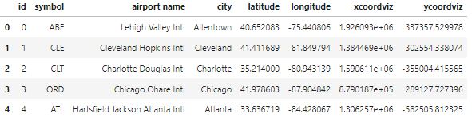
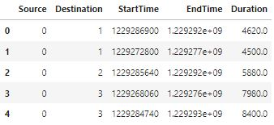
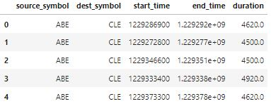
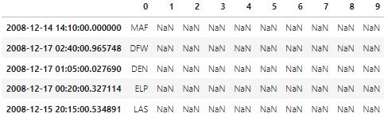
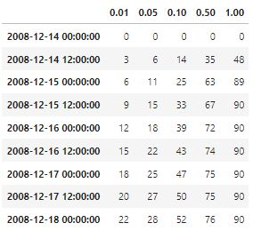
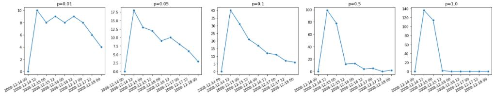
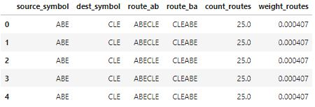
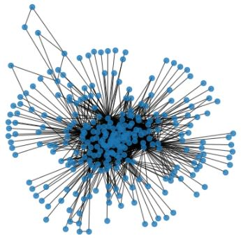
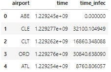
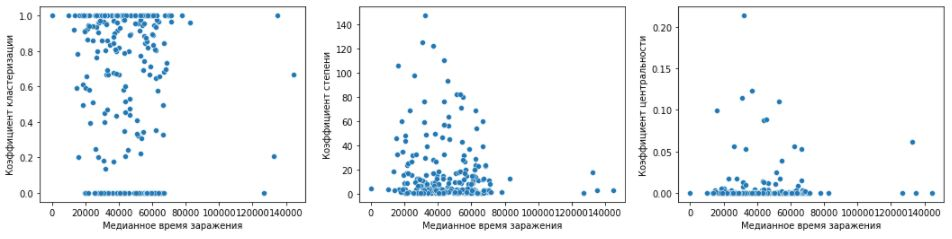

# Симуляция распространения болезни
Построить модель распространения инфекции на основе SI-алгоритма (susceptible-infected), в котором каждый аэропорт имеет два возможных состояния - "здоровый" или "зараженный". Здоровый аэропорт может заразиться с некоторой вероятностью p (infection probability), если к нему прилетает самолет из зараженного города. Инфекция начинает распространение из некоторого стартового аэропорта и заканчивает распространение, когда все перелеты из датасета завершены. Набор данных представляет собой основные маршруты авиаперелетов в США за один месяц 2008-го года.

## Подключение библиотек
```python
# Импорт основных библиотек
import numpy as np
import pandas as pd
import math

# Импорт библиотеки построения диаграмм и графиков
from matplotlib import pyplot as plt
from matplotlib import dates as mdates
import seaborn as sns

# Импорт библиотеки для работы с сетевыми структурами
import networkx as nx

# Импорт библиотеки научных вычислений
from scipy.stats import spearmanr
```

```python
# Загрузка исходных данных об аэропортах
airport_data = pd.read_csv('US_airport_id_info.csv')

# Вывод датасета
airport_data.head()
```


```python
# Загрузка исходных данных о трафике полета самолетов
traffic_data = pd.read_csv('events_US_air_traffic.txt', sep=' ')

# Вывод датасета
traffic_data.head()
```


```python
# Объединение исходных данных в один общий датасет
events_data = traffic_data.merge(airport_data[['id','symbol']], left_on='Source', right_on='id')
events_data = events_data.merge(airport_data[['id','symbol']], left_on='Destination', right_on='id')

# Определение необходимых столбцов и указание удобных наименований
events_data = events_data[['symbol_x', 'symbol_y', 'StartTime', 'EndTime', 'Duration']]
events_data.columns = ['source_symbol', 'dest_symbol', 'start_time', 'end_time', 'duration']

# Вывод датасета
events_data.head()
```


## Симуляция заражения
```python
# Функция имитации одного прохода распространения инфекции
def spread_infection(infec_airport, infec_prob):
    # Определение начала времени заражения
    start_time = events_data[events_data.source_symbol==infec_airport].start_time.min()
    
    # Определение общего списка зараженных аэропортов
    infec_airports = {start_time: infec_airport}
    
    # Имитация распространения инфекции и заражения городов
    for row in events_data.itertuples():
        if (row.source_symbol in infec_airports.values()) and (row.dest_symbol not in infec_airports.values()):
            if np.random.binomial(1, infec_prob) == 1:
                infec_airports[row.end_time + np.random.random()] = row.dest_symbol
    
    return infec_airports
```

## Как инфекционность влияет на скорость распространения
```python
# Результаты имитаций заражения
simulated_infec = []

# Имитация заражения городов с разной инфекционностью
for prob in [0.01, 0.05, 0.1, 0.5, 1.0]:
    # Результат одной имитации
    infec_airports = []
    
    # Имитация заражения городов с несколькими проходами
    for iteration in range(10):
        random_airport = np.random.choice(events_data.source_symbol.unique())
        infec_airports.append(spread_infection(random_airport, prob))
    
    # Конвертирование данных имитации заражения в датасет
    result_df = pd.DataFrame(infec_airports).stack().unstack(0)
    result_df.index = result_df.index.map(lambda x: pd.Timestamp.fromtimestamp(x))
    
    # Формирование списка результатов имитаций
    simulated_infec.append(result_df)

# Вывод одного из датасетов
simulated_infec[0].head()
```


```python
# Количество аэропортов
count_airports = len(events_data.dest_symbol.unique())

# Датасеты с количеством зараженных городов
count_infec = []

# Формирование для каждой вероятности датасета с
# количеством зараженных городов в интервале 12 часов
for i in range(len(simulated_infec)):
    group_times = simulated_infec[i].resample('12H').count()
    count_infec.append(group_times.apply(lambda x: np.around(x.mean(), 0), axis=1))

# Объединение датасетов для разных вероятностей в один общий
count_infec_df = pd.concat(count_infec, keys=[0.01, 0.05, 0.1, 0.5, 1.0])
count_infec_df = count_infec_df.unstack(0, fill_value=0)

# Вывод процента зараженных аэропортов для каждых 12 часов симуляции
(count_infec_df.cumsum() / count_airports * 100).astype(int)
```


```python
# Определение размера диаграммы
fig, axes = plt.subplots(1, 5, figsize=(24, 4))

# Вывод числа зараженных городов в зависимости от времени для каждой из вероятностей
for ax, column in zip(axes.flatten(), count_infec_df.columns):
    sns.lineplot(x=count_infec_df.index, y=count_infec_df[column],  marker="o", ax=ax)
    
    # Определение формата вывода дат оси абсцисс и заголовков диаграмм
    ax.xaxis.set_major_formatter(mdates.DateFormatter("%Y-%m-%d %H"))
    ax.xaxis.set_major_locator(mdates.AutoDateLocator(maxticks=10))
    ax.set(xlabel='', ylabel='', title='p='+str(column))

# Поворот меток оси абсцисс на 30 градусов
plt.gcf().autofmt_xdate()

# Вывод диаграммы
plt.show()
```


## Может ли информация о сети помочь предсказать, кто будет заражен?
```python
# Создание датасета маршрутов следования самолетов
routes_data = events_data[['source_symbol', 'dest_symbol']].copy()

# Формирование маршрутов следования самолетов
routes_data['route_ab'] = routes_data.source_symbol + routes_data.dest_symbol
routes_data['route_ba'] = routes_data.dest_symbol + routes_data.source_symbol

# Определение числа перелетов между аэропортами
for row in routes_data.itertuples():
    routes_data.loc[row.Index, 'count_routes'] = (
        (routes_data.route_ab.values==row.route_ab).sum() + (routes_data.route_ab.values==row.route_ba).sum()
    )

# Определение веса каждого маршрута
routes_data['weight_routes'] = routes_data['count_routes'] / len(routes_data)

# Расстановка столбцов датасета в нужном порядке
routes_data = routes_data[['source_symbol', 'dest_symbol', 'route_ab', 
                           'route_ba', 'count_routes', 'weight_routes']]

# Вывод датасета
routes_data.head()
```


```python
# Определение размера диаграммы
plt.figure(figsize=(6, 6))

# Построение графа
graph = nx.from_pandas_edgelist(routes_data, 'source_symbol', 'dest_symbol', 'weight_routes')

# Вывод графа
nx.draw(graph, node_size=70, alpha=0.8)
```


```python
# Результаты имитаций заражения
simulated_infec = []
    
# Имитация заражения городов с несколькими проходами
for iteration in range(50):
    infec_airports = pd.DataFrame(spread_infection('ABE', 0.5).items(), columns=['time', 'airport'])
    simulated_infec.append(infec_airports)

# Объединение результатов имитации в один общий датасет
simulated_infec_df = pd.concat(simulated_infec)

# Определение времени до заражения каждого аэропорта
start_time = simulated_infec_df[simulated_infec_df.airport=='ABE'].time.min()
simulated_infec_df['time_infec'] = simulated_infec_df.time - start_time

# Расстановка столбцов датасета в нужном порядке
simulated_infec_df = simulated_infec_df[['airport', 'time', 'time_infec']]
    
# Вывод датасета
simulated_infec_df.head()
```


```python
# Вывод медианного времени до заражения каждого города
median_metric = simulated_infec_df.groupby('airport')['time_infec'].median().sort_index()
median_metric.head()
```
```
airport
ABE        0.000000
ABI    55200.556190
ABQ    62220.130756
ABY    39900.096228
ACT    44400.653189
Name: time_infec, dtype: float64
```

```python
# Вывод коэффициента кластеризации
clustering_metric = pd.Series(nx.clustering(graph)).sort_index()
clustering_metric.head()
```
```
ABE    1.000000
ABI    0.000000
ABQ    0.647783
ABY    0.000000
ACT    0.000000
dtype: float64
```

```python
# Вывод степени графа
degree_metric = pd.Series(dict(nx.degree(graph))).sort_index()
degree_metric.head()
```
```
ABE     5
ABI     1
ABQ    29
ABY     1
ACT     1
dtype: int64
```

```python
# Вывод центральности графа
centrality_metric = pd.Series(nx.betweenness_centrality(graph)).sort_index()
centrality_metric.head()
```
```
ABE    0.000000
ABI    0.000000
ABQ    0.002584
ABY    0.000000
ACT    0.000000
dtype: float64
```

```python
# Определение размера диаграммы
fig, axes = plt.subplots(1, 3, figsize=(18, 4))

# Построение диаграмм рассеивания для метрик
sns.scatterplot(x=median_metric, y=clustering_metric, ax=axes[0])
sns.scatterplot(x=median_metric, y=degree_metric, ax=axes[1])
sns.scatterplot(x=median_metric, y=centrality_metric, ax=axes[2])

# Вывод подписей оси абсцисс и оси ординат
axes[0].set(xlabel='Медианное время заражения', ylabel='Коэффициент кластеризации')
axes[1].set(xlabel='Медианное время заражения', ylabel='Коэффициент степени')
axes[2].set(xlabel='Медианное время заражения', ylabel='Коэффициент центральности')

# Вывод диаграммы
plt.show()
```


```python
# Расчет ранговой корреляции Спирмена для полученных метрик графа
coef, p_value = spearmanr(median_metric, clustering_metric)
print('Коэффициент Спирмена для Median и Clustering:  coef={:.2f}  p-value={:.2f}'.format(coef, p_value))

coef, p_value = spearmanr(median_metric, degree_metric)
print('Коэффициент Спирмена для Median и Degree:      coef={:.2f}  p-value={:.2f}'.format(coef, p_value))

coef, p_value = spearmanr(median_metric, centrality_metric)
print('Коэффициент Спирмена для Median и Centrality:  coef={:.2f}  p-value={:.2f}'.format(coef, p_value))
```
```
Коэффициент Спирмена для Median и Clustering:  coef=0.07  p-value=0.23
Коэффициент Спирмена для Median и Degree:      coef=-0.05  p-value=0.37
Коэффициент Спирмена для Median и Centrality:  coef=-0.05  p-value=0.40
```
## Выводы
Визуальная оценка с помощью диаграмм рассеивания показывает, что линейной статистической зависимости между метриками **Clustering**, **Degree**, **Centrality** и **Медианным временем заражения** нет. Что также подтверждает коэффициент ранговой корреляции Спирмена (значения близки к нулю) и p-value (значения больше уровня значимости alpha=0.05).
